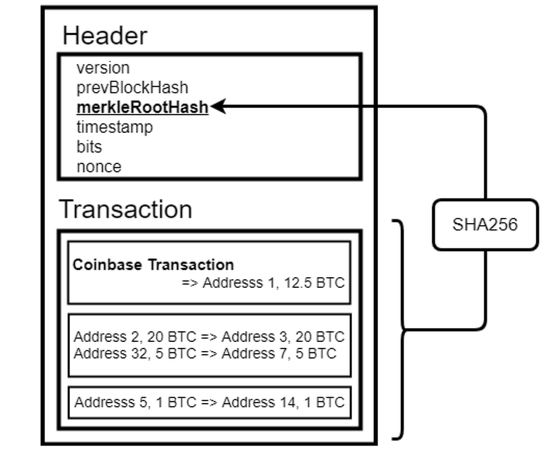

# MerkleTree

*This repository is part of the homework problems for week 2 - Blockchain Storage of the Ethereum Dev. Bootcamp*

[Checkout Alchemy University](https://university.alchemy.com)

## Merkle Trees in Blockchains
Merkle Trees are awesome! They allow us to verify if a piece of data is part of a larger data structure, without having all of the data within that structure. This means they can be used to check for inconsistencies in all kinds of distributed systems!

For Blockchain, storing transactions as Merkle Trees allows us to look at a block and verify that a transaction was part of it by only having part of the data set!

## Merkle Trees In Bitcoin
The design of merkle trees makes them extremely efficient for data verification. In Bitcoin, Merkle trees are used to store every transaction mined on the Bitcoin network in an efficient way:



## Merkle Proofs
The benefit of the Merkle tree design -- a recursive hashing-based algorithm -- is that it allows for efficient proof that some data exists within the root hash construction (actually contained in the block!); in other words, it allows for Merkle proofs. A Merkle proof confirms specific transactions represented by a leaf or branch hash within a Merkle hash root.

So if anyone ever needs to prove that a transaction existed at one point in time in the blockchain, they just need to provide a Merkle proof.


In the diagram above, say you want to prove that C (some random tx) exists in this block. Thanks to Merkle proofs, you only need 3 total pieces of data:

```AsciiDoc
D, H(A-B), H(E-H) to construct the tree root hash: H(A-H). 
```
That might not seem like much with such a small tree, but what about a tree containing over 10,000 transactions? If one is able to successfully construct the root hash, then that is proof enough that their transaction was indeed part of that Merkle tree at that time. Data verification FTW!

## Merkle Trees Use Cases
Merkle trees are:
- space and computationally efficient
- good for scalability and decentralization
- no need to pack a block full of transactions… just commit a Merkle root hash to it and keep transactions in other places that can handle them

In deeper terms, they:
1. They significantly reduce the memory needed to verify that data has maintained its integrity and hasn’t been altered.
2. They require less data to be broadcast across the blockchain network to verify data and transactions. This improves the efficiency of a blockchain.
3. They allow for [Simple Payment Verification (SPV)](https://wiki.bitcoinsv.io/index.php/Simplified_Payment_Verification), which helps you to verify a transaction without downloading an entire block or blockchain. This allows you to send and receive transactions using a light-client node — more commonly known as a *crypto wallet*.

When verifying data using a Merkle tree, there is a **Prover** and a **Verifier**:
- A Prover: Does all the calculation to create the merkle root (just a hash!)
- A Verifier: Does not need to know all the values to know *for certain* one value is in the tree

Merkle trees are a huge benefit to the **Verifier**. You either produce a proof successfully, meaning data verification passes, or you don't, meaning your piece of data was not present when the Merkle root hash was calculated (or you performed the calculation wrong!).

## Merkle Tree Vocabulary Summary

Final terminology for Merkle trees:

- **Merkle tree**: a structure used in computer science to validate data
- **Merkle root**: the hash contained in the block header, which is derived from the hashes of all other transactions in the block
- **Merkle path**: represents the information which the user needs to calculate the expected value for the Merkle root for a block, from their own transaction hash contained in that block. The Merkle path is used as part of of the Merkle proof
- **Merkle proof**: proves the existence of a specific transaction in a specific block (without the user needing to examine all the transactions in the block). It includes the Merkle root and the Merkle path

## Conclusion

Merkle trees are a very popular data structure in blockchains. It's important to understand the low-level of blockchain storage and the implications of such decisions. Keeping data storage lean and efficient is the reason behind using structures like Merkle trees - this understanding is essential as you start building out dApps, you always want to be lean and efficient with your data storage. Why? Because on Ethereum, the less efficient your use of data storage, the more expensive your program will be for you and your users.

